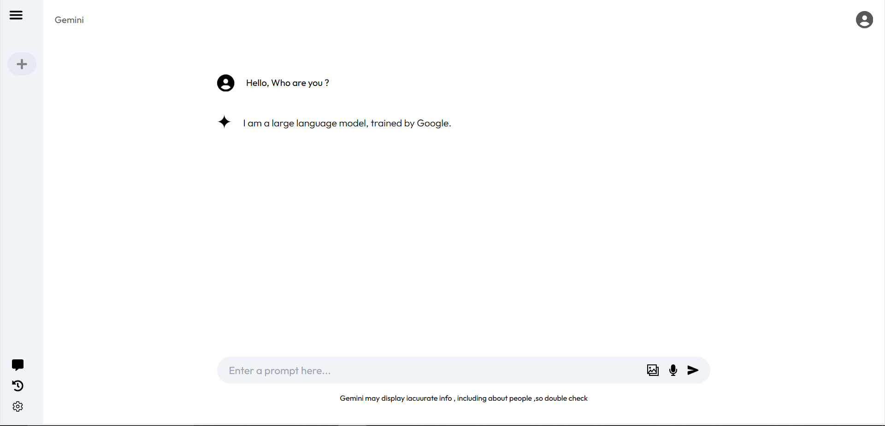

# Chat AI using Gemini API ✨

This project is a responsive and fully functional Chat AI application built using **React.js** and **Tailwind CSS**. The application integrates with the **Gemini API** to deliver conversational capabilities, enabling users to interact with the AI effectively. The project aims to replicate a modern chat interface with a clean design and dynamic functionality.

---

## Features 📊

- **Real-time Chat** ⏳: Allows users to interact with the AI seamlessly.
- **Gemini API Integration** 🧰: Powers the chat functionality using Gemini's natural language processing capabilities.
- **Responsive Design** 💻: Fully optimized for desktops, tablets, and mobile devices.
- **Component-Based Architecture** 🔧: Maintains modularity and reusability with clearly defined React components.
- **User-Friendly UI** 🔍: Clean and intuitive interface built with Tailwind CSS.

---

## Installation ⚙️

Follow the steps below to run the project locally:

1. Clone the repository:

   ```bash
   git clone https://github.com/mkkapadi12/Gemini-AI.git
   cd Gemini-AI
   ```

2. Install dependencies:

   ```bash
   npm install
   ```

3. Set up your environment variables:

   - Create a `.env` file in the root directory.
   - Add your Gemini API key:
     ```env
     GEMINI_API_KEY=your_api_key_here
     ```

4. Start the development server:

   ```bash
   npm run dev
   ```

5. Open the application in your browser at:
   ```
   http://localhost:5173
   ```

---

## Components 💡

### 1. **Header** 🔹

- Displays the application name and user profile avatar.

### 2. **Sidebar** 🔃

- Includes icons for navigation (e.g., help, history, and settings).

### 3. **Chat Area** 💬

- Displays the conversation between the user and the AI.
- Includes user input and AI response components.

### 4. **Input Box** ✉️

- Accepts user queries.
- Includes buttons for sending messages and uploading files/images.

---

## Screenshots 🖼️

### Chat Screen



---

## Usage ⚡️

1. Start the application and interact with the AI by entering your queries in the text box.
2. View AI responses dynamically generated by the Gemini API.
3. Use additional features like uploading images or files to enrich interactions.

---

## Technologies Used 📚

- **React.js**: Frontend framework for building the user interface.
- **Tailwind CSS**: Styling framework for responsive design.
- **Gemini API**: Backend AI integration for chat functionalities.
- **Vercel**: Deployment platform.

---

## Deployment 🌐

The project is deployed on **Vercel**. To deploy your own version:

1. Create a Vercel account and link your GitHub repository.
2. Set up environment variables in the Vercel dashboard.
3. Deploy your project with one click.

---

## Future Enhancements 🚀

- Add multi-language support.
- Implement user authentication.
- Integrate with other APIs for advanced features.
- Enhance the UI with animations.

---

## Contributing 📚

Contributions are welcome! To contribute:

1. Fork the repository.
2. Create a new branch:
   ```bash
   git checkout -b feature/your-feature-name
   ```
3. Commit your changes and push:
   ```bash
   git commit -m "Add your message here"
   git push origin feature/your-feature-name
   ```
4. Open a pull request.

---

## License 🔒

This project is licensed under the MIT License. See the LICENSE file for details.

---

## Acknowledgments 🙏

- Special thanks to the Gemini API team for providing the core functionality.
- Tailwind CSS for making UI development effortless.
- React.js for the robust frontend framework.
